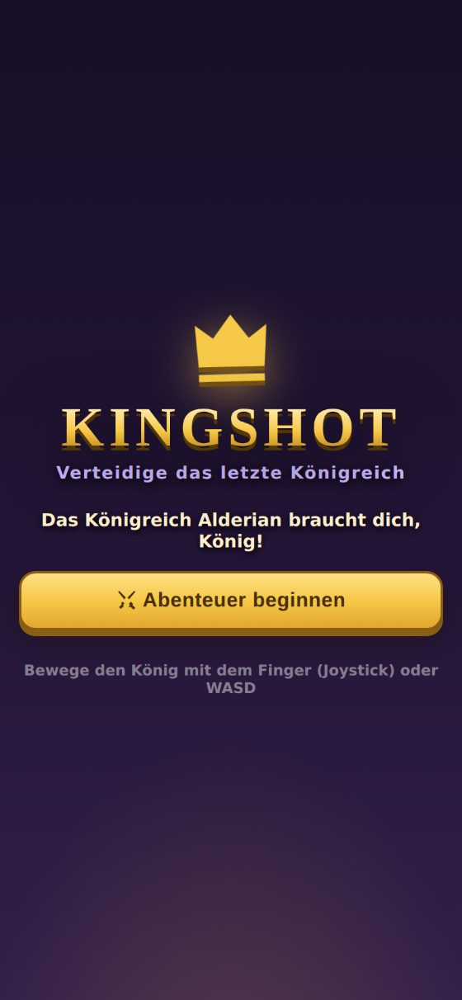
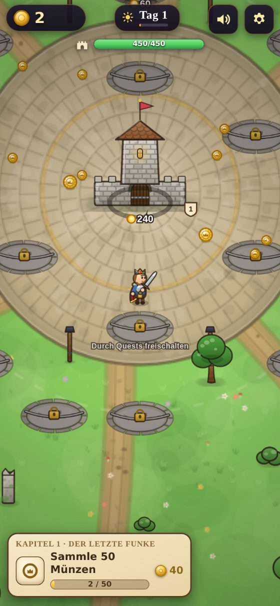
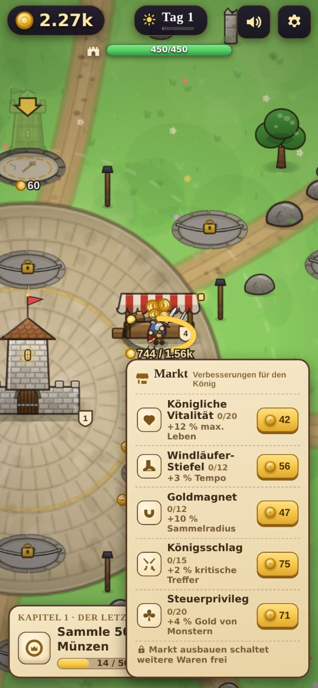
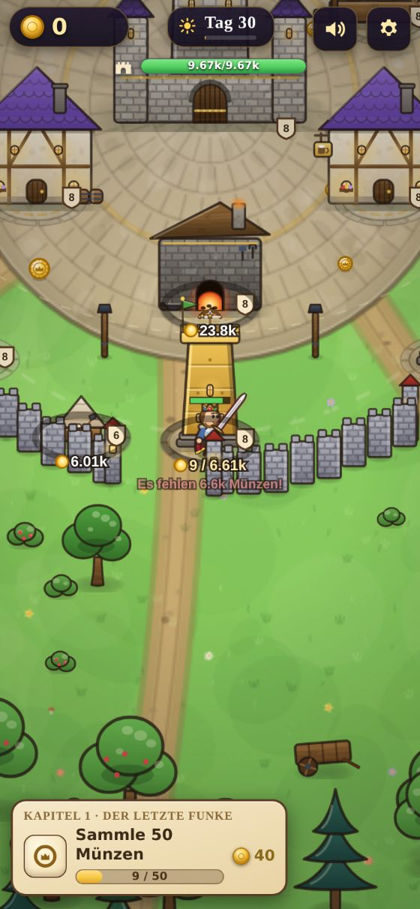
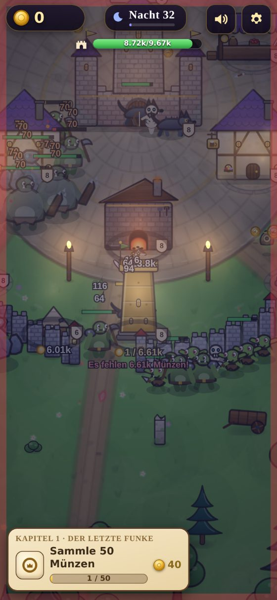
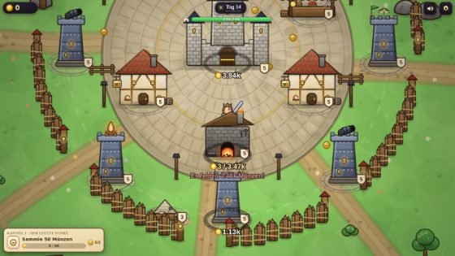

# 👑 KINGSHOT — Verteidige das letzte Königreich

Ein komplettes Browser-Spiel im Stil der berühmten „Kingshot“-Werbung: Du steuerst den König
direkt mit einem unsichtbaren Joystick, verteidigst deine Burg gegen endlose Monsterwellen,
sammelst die Goldmünzen deiner besiegten Feinde ein — und lässt sie **extrem satisfying**
auf Bauplatten regnen, um Türme, Minen, Tavernen und mehr durch viele Stufen auszubauen.

Kein Build-Tool, keine Abhängigkeiten, kein Backend — pures HTML5/Canvas/JavaScript.
Läuft auf jedem Handy und Desktop-Browser, direkt von deinem eigenen nginx-Server.

| | | |
|---|---|---|
|  |  |  |
|  |  | |



---

## 🚀 Installation auf dem Linux-Server (nginx, HTTPS)

Das Install-Skript legt eine **eigene** nginx-Site an (eigene Conf-Datei) und fasst
**keine bestehenden Sites an**. Vor jedem Neuladen wird `nginx -t` geprüft — schlägt
der Test fehl, wird die Änderung **automatisch zurückgenommen** und der alte Zustand
wiederhergestellt.

### Empfohlen: HTTPS mit eigener (Sub-)Domain

```bash
git clone https://github.com/DtheGCoder/Kingshot.git
cd Kingshot
sudo ./deploy/install.sh --domain kingshot.deine-domain.de
```

Fertig → **https://kingshot.deine-domain.de**

Das Skript kümmert sich komplett um HTTPS:
- **Vorhandene Let's-Encrypt-Zertifikate werden automatisch erkannt** und genutzt —
  auch Wildcard-Zertifikate (`*.deine-domain.de`)
- Fehlt ein Zertifikat, holt es eines per `certbot certonly --webroot`
  (bei allererster Certbot-Nutzung `--email deine@mail.de` mitgeben)
- HTTP wird per 301 auf HTTPS umgeleitet; der ACME-Pfad für
  **Zertifikats-Verlängerungen bleibt frei** und nginx lädt nach jeder
  Verlängerung automatisch neu (Renewal-Hook)
- Eigenes Zertifikat? `--cert /pfad/fullchain.pem --key /pfad/privkey.pem`

Voraussetzung: Die (Sub-)Domain zeigt per DNS (A-/AAAA-Record) auf den Server.

### Alternative: nur HTTP auf eigenem Port (z. B. zum Testen)

```bash
sudo ./deploy/install.sh                   # → http://SERVER-IP:8090
sudo ./deploy/install.sh --port 8181       # anderer Port
```

### Weitere Optionen

```bash
sudo ./deploy/install.sh --install-nginx                # nginx automatisch mitinstallieren
sudo ./deploy/install.sh --root /srv/www/kingshot       # anderes Webroot
sudo ./deploy/install.sh --domain D --no-https          # Domain, bewusst ohne TLS
```

### 🔒 Sicherheit — dein Server bleibt geschützt

- **Rein statische Site**: kein Backend, keine Datenbank, kein PHP, keine Uploads —
  der Server liefert nur Dateien aus. Spielstände liegen ausschließlich im Browser
  der Spieler (`localStorage`), auf dem Server wird nichts gespeichert.
- **TLS 1.2/1.3 only** mit modernen Cipher-Suiten (bzw. deiner Certbot-Standardkonfig)
  und **HSTS** (Browser erzwingen HTTPS für die Domain).
- **Strikte Content-Security-Policy** (`default-src 'none'` — nur eigene Skripte/Styles
  und Google Fonts erlaubt), dazu `nosniff`, `X-Frame-Options`, `Referrer-Policy`
  und `Permissions-Policy` (Kamera/Mikro/Standort komplett aus).
- Webroot gehört `root` und ist für den Webserver **nur lesbar** — selbst ein
  kompromittierter nginx-Worker könnte die Dateien nicht verändern.
- Versteckte Dateien (`/.…`) werden nie ausgeliefert, `server_tokens off`.
- Das Skript prüft vorab **Port- und Domain-Konflikte** mit bestehenden Sites und
  schreibt ausschließlich in seine eigene `kingshot.conf`.

### Updaten / Entfernen

```bash
sudo ./deploy/update.sh        # git pull + Dateien neu kopieren (Spielstände bleiben!)
sudo ./deploy/uninstall.sh     # nur die Kingshot-Site entfernen
sudo ./deploy/uninstall.sh --purge   # zusätzlich das Webroot löschen
```

### Schnell lokal testen (ohne nginx)

```bash
./deploy/serve-lokal.sh        # → http://localhost:8080
```

---

## 🎮 So spielt es sich

- **Steuerung:** Finger irgendwo aufs Spielfeld legen → unsichtbarer Joystick erscheint
  genau dort. Am Desktop: **WASD** oder Pfeiltasten. Der König greift automatisch an.
- **Gold:** Jedes besiegte Monster lässt Münzen fallen — einfach hindurchlaufen,
  der Magnet zieht sie an.
- **Bauen:** Auf eine leuchtende Bauplatte stellen → die Münzen fließen automatisch
  hinein (immer schneller!). Reicht das Gold nicht, bleibt der Fortschritt gespeichert
  und die Platte zeigt an, **wie viel noch fehlt**.
- **Tag & Nacht:** Tagsüber bauen, sammeln und produzieren — nachts kommt die Flut.
  Alle 5 Nächte wartet ein **Boss**.
- **Niederlage?** Halb so wild: Der König steht wieder auf, die Burg wird notdürftig
  geflickt, ein Teil des getragenen Goldes geht verloren — weiter geht's am selben Tag.

## 🏰 Gebäude (je 10 Stufen, mit sichtbarer Evolution: Holz → Stein → Eisen → Gold → Kristall)

| Gebäude | Wirkung |
|---|---|
| 🏰 **Burg** | Herzstück — mehr HP, heilt sich langsam selbst |
| 🏹 **Wachtürme** (3×) | Schnelle Pfeile |
| 💣 **Kanonentürme** (2×) | Flächenschaden |
| ❄️ **Frostturm** | Verlangsamt Feinde |
| ⚡ **Blitzturm** | Kettenblitze über mehrere Ziele |
| 🔥 **Flammenturm** | Feuerkegel + Brandschaden |
| ⛏️ **Goldminen** (2×) | Produzieren laufend Münzen zum Abholen |
| 🍺 **Tavernen** (2×) | Beherbergen Überlebende, die Steuern zahlen |
| ⚒️ **Schmiede** | Schmiedet 10 immer mächtigere Königsklingen (ab Stufe 5 mit Klingenwelle!) |
| 🛒 **Markt** | Shop mit 6 dauerhaften König-Upgrades: Leben, Tempo, Magnet, Krit, Gold, Rüstung |
| 🧱 **Stadtmauer** | Ring aus 16 Abschnitten mit eigenen HP — Monster brechen durch, Tore bleiben offen, morgens wird repariert |
| ✨ **Schrein des Lichts** | Heil-Aura für König und Burg |

## 👹 Monster — 24 Arten in 12 Klassen + 10 Bosse

Von **Klasse 1** (Grünschleim, ganz harmlos) über Goblins, Spinnen, Untote, Orks,
Schattenwölfe, Trolle und Golems bis zu Dämonen und **Klasse 12** (Junge Drachen).
Monster werden mit jedem Tag stärker *und sichtbar größer*; ab Tag 12 erscheinen
goldene **Elite**-Varianten. Bosse alle 5 Nächte: Schleimkönig, Goblin-Häuptling,
Spinnenkönigin, Knochenfürst, Ork-Kriegsherr, Trollkönig, Golem-Koloss, Dämonenfürst,
Drachenmutter — und in Nacht 50 der **Weltenfresser**.

## 📖 Der rote Faden

10 Story-Kapitel mit ~40 Quests führen vom ersten Funken („Sammle 50 Münzen“) bis zum
neuen Königreich — jedes Kapitel bringt eine kleine Geschichte, neue Bauplätze, neue
Monsterklassen und einen Boss. Danach beginnt die **Ewige Wacht**: endlose Nächte,
rotierende, immer stärkere Bosse und generierte Meilenstein-Quests. In der Chronik
(⚙️-Menü) kannst du deine ganze Legende nachlesen.

## 💾 Auto-Save — wirklich lückenlos

- Speichert **alle 2 Sekunden** sowie bei jedem wichtigen Ereignis
- Zusätzlich beim Verlassen/Minimieren der Seite (`pagehide`, `beforeunload`, Tab-Wechsel)
- **Doppelter Speicherslot**: ein korrupter Slot kann nie den Spielstand zerstören
- Browser abstürzen lassen, Tab schließen, Handy neustarten — beim nächsten Öffnen
  geht es **exakt an derselben Stelle** weiter, sogar mitten in einer Bossnacht
  (Monster stehen wieder da, wo sie standen)
- Spielstand-Export/-Import als Text im ⚙️-Menü (z. B. für Gerätewechsel)

> Der Spielstand liegt im `localStorage` des Browsers — er gehört zur Domain/Port-Kombination.
> Wenn du das Spiel später auf einen anderen Port/eine Domain umziehst, nutze vorher den Export.

## 🛠️ Technik

- Vanilla JS + Canvas 2D, ~60 FPS auch auf Mobilgeräten (Sprite-Caching, Spatial-Hashing, Objekt-Pools)
- Sämtliche Grafiken werden **prozedural** gezeichnet (kein einziges Bild-Asset) — mit Ziegel-,
  Holz- und Stein-Texturen, Schindeldächern, weichen Schatten und Glanzlichtern
- UI komplett mit **eigenen SVG-Icons** (keine Emojis)
- Sound: WebAudio-Synthesizer (Münzklirren mit steigender Tonhöhe!) + dezente generative Musik
- Responsive von Smartphone-Hochformat bis Ultrawide, Safe-Area-Unterstützung fürs iPhone
- Debug-Konsole: Spiel mit `?debug=1` öffnen → `KS.debug.gold(1000)`, `KS.debug.night()`, `KS.debug.buildAll(10)`, …

## 📂 Projektstruktur

```
index.html            Einstieg & HUD
css/style.css         UI-Design (Pergament & Gold)
js/config.js          Balance & Daten: Gebäude, Waffen, Monster, Bosse, Kapitel, Quests
js/core.js            Utilities, Audio-Synth, Joystick, Speicher-I/O
js/art.js             Prozedurale Grafik: alle Sprites, Boden, Requisiten
js/entities.js        Spieler, Monster-KI, Münzen, Projektile, Partikel
js/systems.js         Bauplatten & Einzahlung, Türme, Produktion, Tag/Nacht-Direktor, Quests
js/ui.js              HUD, Toasts, Banner, Story-Overlays, Menü
js/game.js            Game-Loop, Renderer, Kamera, Licht, Auto-Save
deploy/               install.sh · update.sh · uninstall.sh · serve-lokal.sh
```

Viel Spaß beim Verteidigen, König! ⚔️
