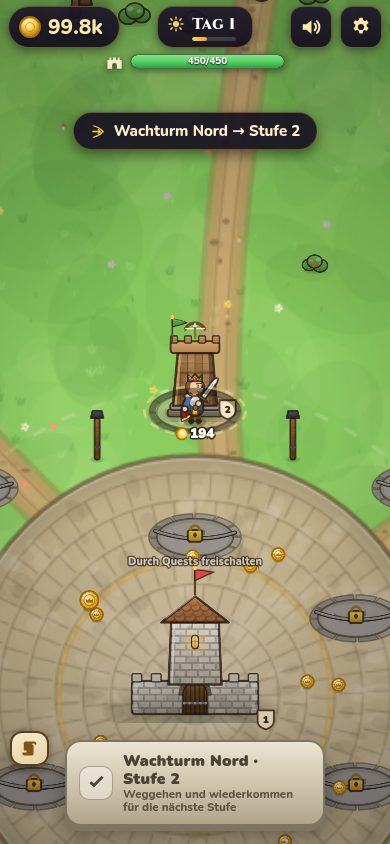
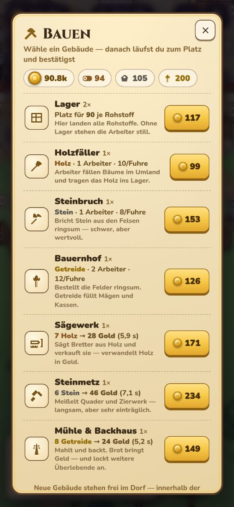
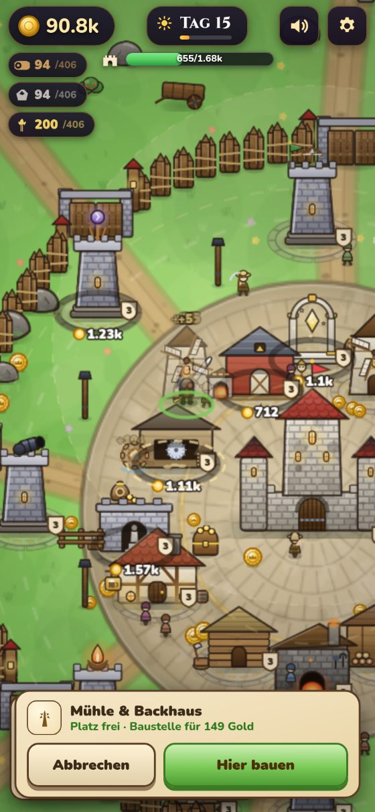
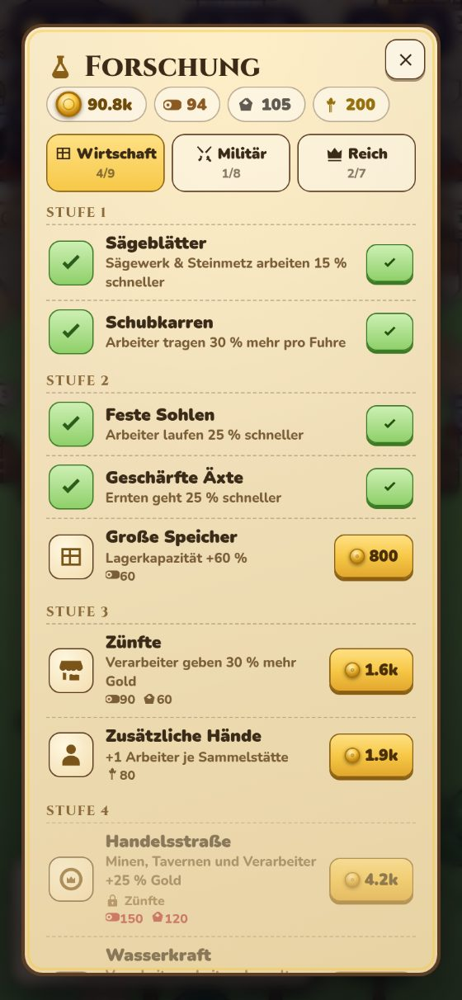
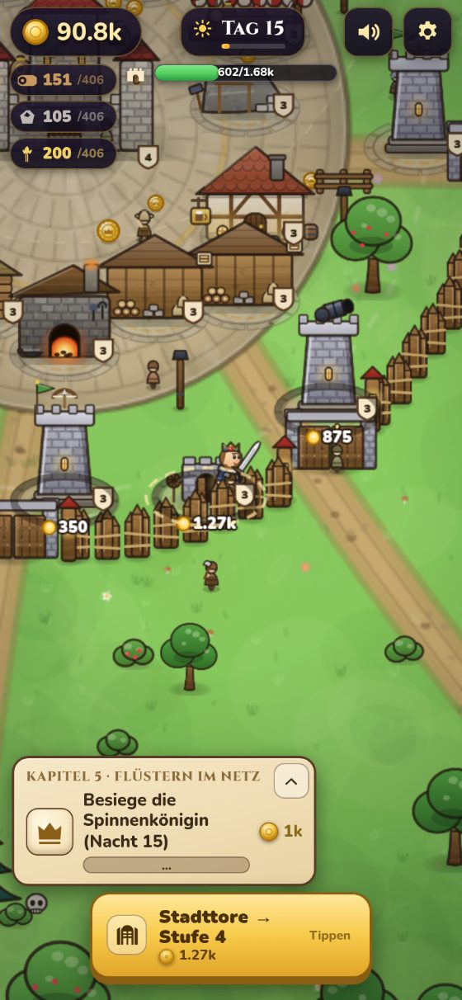
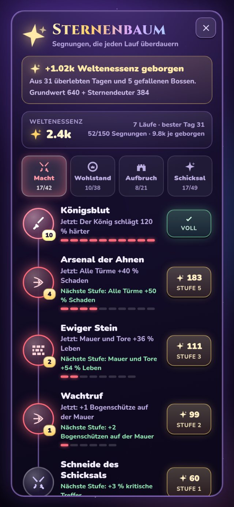
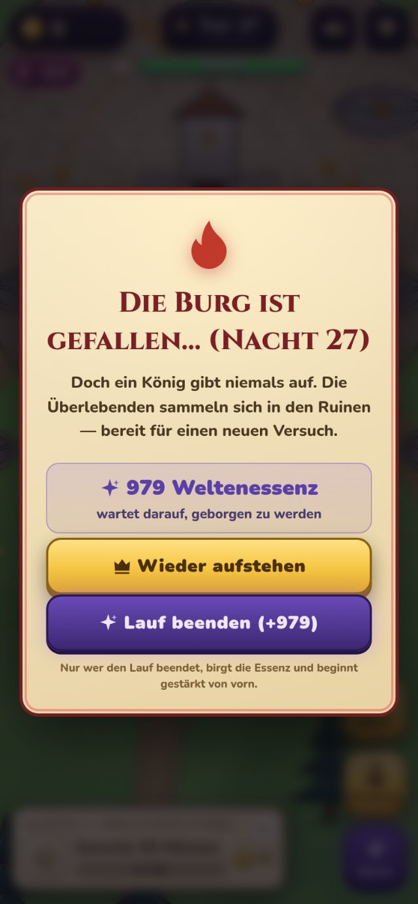
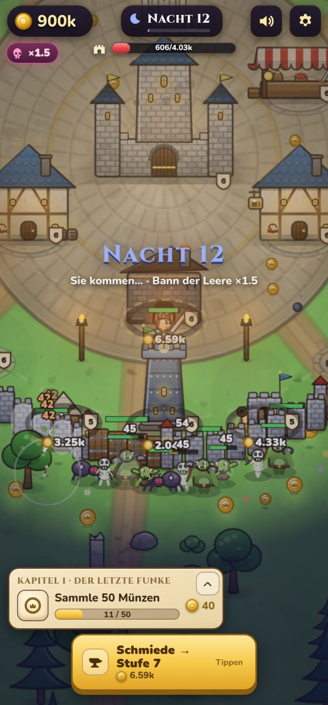
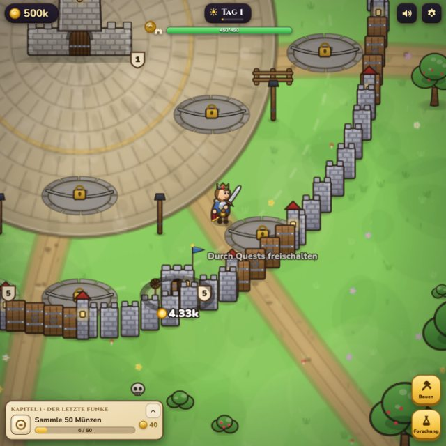
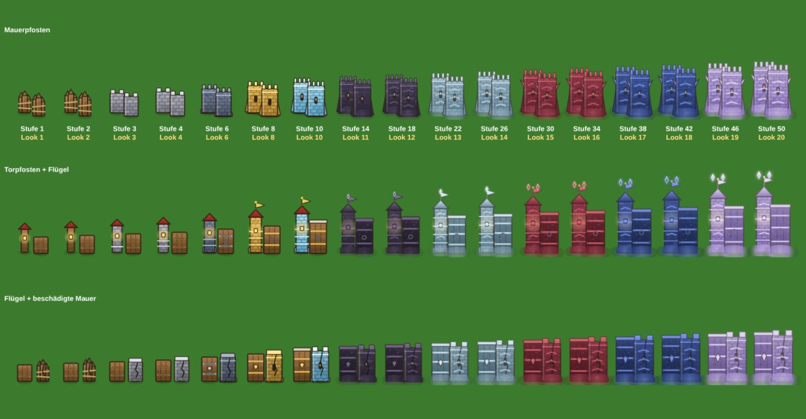

# 👑 KINGSHOT — Verteidige das letzte Königreich

Ein komplettes Browser-Spiel im Stil der berühmten „Kingshot“-Werbung: Du steuerst den König
direkt mit einem unsichtbaren Joystick, verteidigst deine Burg gegen endlose Monsterwellen,
sammelst die Goldmünzen deiner besiegten Feinde ein — und lässt sie **extrem satisfying**
auf Bauplatten regnen, um Türme, Minen, Tavernen und mehr durch viele Stufen auszubauen.
Dazu baust du eine echte Wirtschaft: Holzfäller, Steinbruch und Bauernhof schicken
Arbeiter ins Umland, Sägewerk, Steinmetz und Mühle machen aus ihren Fuhren wieder Gold —
und ein Techtree mit 25 Neuerungen lässt dich entscheiden, wohin dein Reich wächst.

Und dann wird es ernst: ab Tag 9 legt sich der **Bann der Leere** über das Land und macht
jede Nacht unerbittlich schwerer. **Kein einzelner Lauf ist zu gewinnen.** Aus überlebten
Tagen und gefallenen Bossen wird **Weltenessenz**, die du im **Sternenbaum** in dauerhafte
Segnungen umsetzt — bis du irgendwann weit genug kommst, um den Weltenfresser zu stellen.

Kein Build-Tool, keine Abhängigkeiten, kein Backend — pures HTML5/Canvas/JavaScript.
Läuft auf jedem Handy und Desktop-Browser, direkt von deinem eigenen nginx-Server.

| | | |
|---|---|---|
|  |  |  |
|  |  |  |
|  |  |  |
|  |  |  |
|  |  |  |
|  |  |  |




---

## 🚀 Installation auf dem Linux-Server (nginx, HTTPS)

Das Install-Skript legt eine **eigene** nginx-Site an (eigene Conf-Datei) und fasst
**keine bestehenden Sites an**. Vor jedem Neuladen wird `nginx -t` geprüft — schlägt
der Test fehl, wird die Änderung **automatisch zurückgenommen** und der alte Zustand
wiederhergestellt.

### Empfohlen: HTTPS mit eigener (Sub-)Domain

```bash
git clone https://github.com/DtheGCoder/Kingshot.git
cd Kingshot
sudo ./deploy/install.sh --domain kingshot.deine-domain.de
```

Fertig → **https://kingshot.deine-domain.de**

Das Skript kümmert sich komplett um HTTPS:
- **Vorhandene Let's-Encrypt-Zertifikate werden automatisch erkannt** und genutzt —
  auch Wildcard-Zertifikate (`*.deine-domain.de`)
- Fehlt ein Zertifikat, holt es eines per `certbot certonly --webroot`
  (bei allererster Certbot-Nutzung `--email deine@mail.de` mitgeben)
- HTTP wird per 301 auf HTTPS umgeleitet; der ACME-Pfad für
  **Zertifikats-Verlängerungen bleibt frei** und nginx lädt nach jeder
  Verlängerung automatisch neu (Renewal-Hook)
- Eigenes Zertifikat? `--cert /pfad/fullchain.pem --key /pfad/privkey.pem`

Voraussetzung: Die (Sub-)Domain zeigt per DNS (A-/AAAA-Record) auf den Server.

### Alternative: nur HTTP auf eigenem Port (z. B. zum Testen)

```bash
sudo ./deploy/install.sh                   # → http://SERVER-IP:8090
sudo ./deploy/install.sh --port 8181       # anderer Port
```

### Weitere Optionen

```bash
sudo ./deploy/install.sh --install-nginx                # nginx automatisch mitinstallieren
sudo ./deploy/install.sh --root /srv/www/kingshot       # anderes Webroot
sudo ./deploy/install.sh --domain D --no-https          # Domain, bewusst ohne TLS
```

### 🔒 Sicherheit — dein Server bleibt geschützt

- **Rein statische Site**: kein Backend, keine Datenbank, kein PHP, keine Uploads —
  der Server liefert nur Dateien aus. Spielstände liegen ausschließlich im Browser
  der Spieler (`localStorage`), auf dem Server wird nichts gespeichert.
- **TLS 1.2/1.3 only** mit modernen Cipher-Suiten (bzw. deiner Certbot-Standardkonfig)
  und **HSTS** (Browser erzwingen HTTPS für die Domain).
- **Strikte Content-Security-Policy** (`default-src 'none'` — nur eigene Skripte/Styles
  und Google Fonts erlaubt), dazu `nosniff`, `X-Frame-Options`, `Referrer-Policy`
  und `Permissions-Policy` (Kamera/Mikro/Standort komplett aus).
- Webroot gehört `root` und ist für den Webserver **nur lesbar** — selbst ein
  kompromittierter nginx-Worker könnte die Dateien nicht verändern.
- Versteckte Dateien (`/.…`) werden nie ausgeliefert, `server_tokens off`.
- Das Skript prüft vorab **Port- und Domain-Konflikte** mit bestehenden Sites und
  schreibt ausschließlich in seine eigene `kingshot.conf`.

### 🚑 Wenn etwas mit nginx nicht stimmt

```bash
sudo ./deploy/notfall.sh          # nur nachsehen: läuft nginx? Config gültig? Logs?
sudo ./deploy/notfall.sh --aus    # Kingshot-Site abschalten + nginx neu laden
sudo ./deploy/notfall.sh --an     # wieder einschalten
```

`--aus` nimmt **nur** die Kingshot-Site heraus und lässt alles andere unangetastet.
Gehen deine Seiten danach wieder, war es Kingshot; bleibt der Fehler, sagt dir
`nginx -t` in der Diagnose, welche fremde Datei und Zeile gemeint ist.

Die Diagnose zeigt außerdem, wer der **default_server** ist — also welche Site
Anfragen an unbekannte Domains beantwortet. Ist dort keiner gesetzt, entscheidet
die Ladereihenfolge der Dateinamen, und dann kann eine Site für fremde Domains
ihr Zertifikat zeigen (Browser meldet einen Zertifikatsfehler, obwohl die Config
der anderen Seite in Ordnung ist). Abhilfe: bei deiner Hauptseite einmalig
`listen 443 ssl default_server;` ergänzen. `install.sh` warnt inzwischen von
selbst, wenn diese Lücke besteht.

### Updaten / Entfernen

> **Welche Version läuft gerade?** Im Spiel ⚙-Menü → *Optionen*, unten steht die
> Version (der Git-Kurz-Hash). Stimmt sie nicht mit `git rev-parse --short HEAD`
> im Repo überein, ist das Update noch nicht durch — dann einmal `sudo ./deploy/update.sh`.

```bash
sudo ./deploy/update.sh        # git pull + Dateien neu kopieren (Spielstände bleiben!)
sudo ./deploy/uninstall.sh     # nur die Kingshot-Site entfernen
sudo ./deploy/uninstall.sh --purge   # zusätzlich das Webroot löschen
```

### 🔄 Auto-Update — neue Versionen kommen von selbst

```bash
sudo ./deploy/install-autoupdate.sh              # prüft alle 5 Minuten
sudo ./deploy/install-autoupdate.sh --interval 15
sudo ./deploy/install-autoupdate.sh --uninstall
```

Danach genügt ein Push auf GitHub — der Rest passiert automatisch:

1. Der Server prüft im Takt, ob es eine neue Version gibt, und holt sie.
2. Spieldateien werden neu deployt und mit einem Versions-Stempel versehen.
3. **Laufende Spiele erkennen die neue Version und laden sich selbst neu** —
   dank Auto-Save geht es exakt an derselben Stelle weiter, sogar mitten
   in einer Bossnacht.

**Bewusst ressourcenschonend gebaut:**

- Der Check ist ein einziger winziger `git ls-remote`-Abgleich des Commit-Hashs
  (kein Fetch, kein Clone). Ist nichts Neues da, passiert **exakt gar nichts** —
  kein Download, kein Schreibzugriff, kein Log-Eintrag. Gemessen: **~30 ms** pro
  Leerlauf-Prüfung, ein vollständiges Update dauert ~130 ms.
- Der systemd-Timer läuft mit `Nice=10` und `IOSchedulingClass=idle`, kann deinen
  Webserver also nie ausbremsen. Ohne systemd wird automatisch ein Cron-Job genutzt.
- `flock` verhindert überlappende Läufe; das Log wird automatisch gekürzt.
- Blockieren lokale Änderungen im Repo den Fast-Forward, sagt das Log **einmal**
  klar, was los ist (kein Retry-Spam) — und sobald du aufgeräumt hast, wird das
  Update automatisch nachgeholt.
- Im Browser fragt das Spiel nur alle 5 Minuten eine ~30-Byte-Datei ab, und das
  nur im Vordergrund. Eine Reload-Bremse schließt Endlos-Neuladen aus.

```bash
systemctl status kingshot-update.timer   # läuft es?
tail -f /var/log/kingshot-update.log     # was ist passiert?
```

### Schnell lokal testen (ohne nginx)

```bash
./deploy/serve-lokal.sh        # → http://localhost:8080
```

---

## 🎮 So spielt es sich

- **Steuerung:** Finger irgendwo aufs Spielfeld legen → unsichtbarer Joystick erscheint
  genau dort. Am Desktop: **WASD** oder Pfeiltasten. Der König greift automatisch an.
- **Gold:** Jedes besiegte Monster lässt Münzen fallen — einfach hindurchlaufen,
  der Magnet zieht sie an.
- **Bauen:** Stell dich auf eine Bauplatte → unten erscheint ein Knopf
  („Wachturm Nord bauen · 60"). Erst **ein Druck darauf** lässt die Münzen fließen
  (immer schneller!) — Vorbeilaufen kostet **nie** Gold. Nochmal drücken hält an,
  Weggehen bricht ab. Reicht das Gold nicht, bleibt der Fortschritt gespeichert
  und die Platte zeigt, **wie viel noch fehlt**. Am Desktop geht auch **Leertaste**;
  alternativ tippst du direkt auf das Gebäude.
- **Immer nur eine Stufe:** Nach jedem fertigen Ausbau ist der Platz gesperrt —
  für die nächste Stufe musst du erst weggehen und wiederkommen. So wandert nie
  unbemerkt dein ganzes Gold in Folgestufen.
- **Quest-Karte einklappen:** Der Knopf oben rechts an der Karte klappt sie zu
  einem kleinen Reiter zusammen, damit der Daumenbereich für den Joystick frei
  bleibt. Der Zustand wird gespeichert.
- **Frei bauen:** Der Knopf **Bauen** unten rechts öffnet die Baumappe. Wählst du
  ein Gebäude, folgt dir ein Geist über den Boden — er zeigt jederzeit, ob der
  Platz taugt, und sagt sonst genau warum („Blockiert einen Weg“, „Zu nah am
  Nachbargebäude“). Bestätigen legt eine Baustelle an, die du wie jede andere mit
  Münzen füllst. Verbaut? Der **Abreißen**-Knopf gibt die Hälfte zurück und fragt
  vorher nach.
- **Forschung:** Der Knopf **Forschung** öffnet den Techtree — 25 Neuerungen in den
  Zweigen Wirtschaft, Militär und Reich, mit Voraussetzungen und Kosten in Gold
  **und** Rohstoffen.
- **Tag & Nacht:** Tagsüber bauen, sammeln und produzieren — nachts kommt die Flut.
  Alle 5 Nächte wartet ein **Boss**. Deine Arbeiter gehen bei Sonnenuntergang von
  selbst in Deckung und morgens wieder aufs Feld. Nachts bleibt die **Stadt
  innerhalb der Mauer hell** — dort baust du weiter und sammelst Münzen; jenseits
  des Mauerrings wird es finster, und die Horde kommt aus dem Dunkeln.
- **Markt:** Der große Aktionsknopf **baut den Markt aus** wie jedes andere Gebäude —
  den Laden öffnet der kleine Knopf daneben. Erst auf der Endstufe, wo es nichts mehr
  zu bauen gibt, öffnet auch der große Knopf den Laden.
- **Niederlage = Ende des Laufs.** Es gibt kein Wiederaufstehen: die Burg fällt, der
  Lauf ist vorbei. Auf dem Niederlagen-Bildschirm birgst du die **Weltenessenz**,
  wählst im **Sternenbaum** deine Segnungen — und beginnst mit **„Lauf N beginnen“**
  von vorn, aber stärker. Der Sternenbaum ist nur auf diesem Weg erreichbar.
- **Freiwillig aufhören:** Im ⚙️-Menü steht neben „Weiterspielen“ ein
  **„Lauf beenden (+N)“** — der Knopf sagt gleich, wieviel Essenz drin ist. Er läuft
  durch **genau denselben Weg** wie eine Niederlage: derselbe Bildschirm (nur mit
  anderem Text und ruhigem Zeichen statt Flamme), dieselbe Essenz, derselbe
  Sternenbaum, derselbe nächste Lauf. Nützlich, wenn eine Nacht ohnehin verloren ist
  oder man gezielt Essenz sammeln will.

## 🏰 Gebäude (je **50 Stufen**, mit sichtbarer Evolution über zehn Materialien)

| Gebäude | Wirkung |
|---|---|
| 🏰 **Burg** | Herzstück — mehr HP, heilt sich langsam selbst |
| 🏹 **Wachtürme** (3×) | Schnelle Pfeile |
| 💣 **Kanonentürme** (2×) | Flächenschaden |
| ❄️ **Frostturm** | Verlangsamt Feinde |
| ⚡ **Blitzturm** | Kettenblitze über mehrere Ziele |
| 🔥 **Flammenturm** | Feuerkegel + Brandschaden |
| ⛏️ **Goldminen** (2×) | Produzieren laufend Münzen zum Abholen |
| 🍺 **Tavernen** (2×) | Beherbergen Überlebende, die Steuern zahlen |
| ⚒️ **Schmiede** | Schmiedet 20 benannte Königsklingen vom Rostigen Schwert bis zum **Urlicht** (ab Stufe 5 mit Klingenwelle!), darüber hinaus als verstärkte Fassungen |
| 🛒 **Markt** | Shop mit 6 dauerhaften König-Upgrades: Leben, Tempo, Magnet, Krit, Gold, Rüstung. Öffnet per Tipp aufs Gebäude — solange er offen ist, **ruht das ganze Spiel** |
| 🧱 **Stadtmauer** | Ring aus 16 Abschnitten mit eigenen HP (780 auf Stufe 1, ×1,5 je Stufe) — Monster brechen einzelne Abschnitte durch, morgens wird repariert. Auf der Mauer stehen **Bogenschützen**: sie beschießen jeden, der an Mauer oder Tor nagt, überall am Ring. Zahl und Schaden wachsen mit der Mauerstufe |
| 🚪 **Stadttore** | Verschließen alle acht Durchgänge, sonst spaziert die Horde einfach hindurch. Eigene HP (1020 auf Stufe 1), werden aufgebrochen und im Morgengrauen wieder eingesetzt |

> **Ausbauen heilt:** Wer Mauer oder Tore eine Stufe hochzieht, bekommt sie sofort
> unbeschädigt zurück — auch bereits durchbrochene Abschnitte und aufgebrochene
> Tore. Frisch gemauert ist frisch gemauert. Ohne Ausbau bleibt Schaden bis zum
> Morgengrauen stehen.
| ✨ **Schrein des Lichts** | Heil-Aura für König und Burg |

### ⛰️ 50 Stufen — was sich dabei ändert

Jedes Gebäude geht bis **Stufe 50**. Bis Stufe 10 bleibt alles wie gehabt, danach
wächst der Preis mit Faktor 1,62 je Stufe — knapp über dem Einkommenswachstum, jede
Stufe kostet also mehr Zeit als die vorige, bleibt aber erreichbar (gemessen: 20
Sekunden Minen-Einkommen für Stufe 1, 450 Sekunden für Stufe 50).

Optisch durchläuft jedes Bauwerk zehn Materialien — Holz, Stein, Eisen, Gold,
Kristall, **Obsidian, Mithril, Blutrubin, Sternenstahl, Ätherglas**. Ab Stufe 11 kommt
Prunk dazu: eine Aura am Sockel, schwebende Kristalle, ab Stufe 13 Banner, ab Stufe 17
eine Lichtkrone über dem Dach.

### 🌾 Wirtschaft — alles endet in Gold

Diese sieben Gebäude setzt du **frei im Dorf** (Bauen-Knopf), so viele du willst,
innerhalb der Mauern und abseits der Wege:

| Gebäude | Rolle |
|---|---|
| 📦 **Lager** | Hier landen alle Rohstoffe. Ohne Lager stehen die Arbeiter still — es ist immer das erste, was du baust. Jede Stufe erhöht den Platz je Rohstoff |
| 🪓 **Holzfäller** | Schickt Arbeiter zu den Bäumen im Umland; sie tragen das Holz ins Lager |
| ⛏️ **Steinbruch** | Dasselbe an Felsen und Ruinen — langsamer, aber Stein ist wertvoller |
| 🌾 **Bauernhof** | Bestellt die eigenen Felder rundherum, kurze Wege, viel Getreide |
| 🪚 **Sägewerk** | Verwandelt Holz in Bretter und die in **Gold** |
| 🔨 **Steinmetz** | Meißelt Quader — langsam, aber sehr einträglich |
| 🥖 **Mühle & Backhaus** | Mahlt Getreide zu Brot: Gold *und* mehr Steuern aus den Tavernen |

Die Kette lautet immer **Sammler → Lager → Verarbeiter → Münzen**, und du siehst jeden
Abschnitt: Arbeiter fällen draußen Bäume und schleppen die Fuhre ins Lager, Träger
bringen den Rohstoff vom Lager zum Werk. Arbeiter wählen ihren Baum nach dem kürzesten
Rundweg, es lohnt sich also, das Lager klug zwischen Hütte und Wald zu setzen. Sammler und Werke wachsen im gleichen Takt: grob ein
Sammler versorgt zwei Verarbeiter. Rohstoffe zahlen außerdem die Forschung.

### 🧪 Techtree — 44 Neuerungen in sechs Stufen

| Zweig | Beispiele |
|---|---|
| 📦 **Wirtschaft** (15) | Schubkarren, Große Speicher, Zünfte, Wasserkraft, Tiefe Schächte (Minen +60 %), Dreifelderwirtschaft (Bauernhöfe doppelt), Granitsägen (Steinmetze +80 %), **Karawanen** (55 k), **Zunftmeister** (62 k), **Königliche Münze** (260 k, alles Gold +50 %) |
| ⚔️ **Militär** (15) | Königsschliff, Ballistik, Nachtwache, Beschlagene Tore (+80 % Torleben), Mauerwache (+2 Bogenschützen), Pechtöpfe, Belagerungsdrill (+70 % gegen Mauerknabberer), Königsgarde, **Bastionen** (48 k, Mauer +120 %), **Drachenfeuer** (320 k, Türme +120 %) |
| 👑 **Reich** (14) | Landvermessung, Rechnungsbuch, Herolde, Baumeister, Boten (+50 % Quest-Gold), Schatzkammer (+40 % Münzwert), Gepflasterte Wege, Volkszählung, Königsfrieden, **Großer Basar** (58 k, Markt −25 %), **Ewige Krone** (400 k, +25 % auf Turm, König und Mauer) |

Die drei Stufe-6-Knoten kosten zusammen fast **1 Million Gold** — sie sind das
Ziel eines tiefen Laufs, nicht der Alltag. Der ganze Baum kostet 1,3 Mio.

### 🛒 Markt — 36 Waren, freigeschaltet durch Ausbau

Der Markt zeigt nicht alles auf einmal: **Stufe 1 legt 3 Waren aus, jede Stufe
etwa eine weitere, ab Stufe 36 liegt das ganze Sortiment bereit.** Die gesperrte
nächste Ware steht immer sichtbar unten mit der Stufe, die sie freischaltet —
deshalb lohnt sich das Aufleveln des Marktes bis ganz oben.

| Gruppe | Waren |
|---|---|
| 🔵 **König** (8) | Vitalität, Windläufer-Stiefel, Königsplatte, Heilende Ruhe, Zähe Konstitution, Standfest, Zweiter Atem, Geweihtes Wappen |
| 🔴 **Kampf** (9) | Königsschlag (Krit), Tödliche Präzision (Kritschaden), Klingenschliff, Schnelle Hand, Lange Klinge, Breiter Schwung, Klingenwelle, Blutzoll (Lebensraub), Henkersstreich |
| ⚪ **Verteidigung** (9) | Schützenausbildung, Nachladedrill, Sichtturm, Mörtel & Stein, Eisenbeschlag, Verstärkter Bergfried, Wachtruf, Scharfe Bolzen, Maurertrupp |
| 🟡 **Reich** (10) | Steuerprivileg, Goldmagnet, Münzprägung, Fleißige Maurer, Verhandlungskunst, Größere Körbe, Feste Wege, Bessere Werkzeuge, Werksmeister, Tieferer Keller |

Alle 36 voll ausgebaut kosten rund **2,9 Millionen Gold** — ein Sog, der bis in
die Ewige Wacht reicht. Jede Ware ist nachgemessen verdrahtet: es gibt keine
Zeile, die nur nett klingt.

### 🌙 Licht in der Nacht

Die Dunkelheit liegt nicht mehr gleichmäßig über der Karte. In den Lichtpuffer
wird zuerst eine **Stadtmaske** gestanzt: bis kurz vor die Mauer ein flaches
Plateau voller Helligkeit, dann ein lesbarer Streifen über den Mauerring und
etwa 120 px davor — genau dort, wo die Angreifer stehen —, danach volle Nacht.
Ein normaler Radialverlauf wäre in der Mitte hell und am Rand schwarz gewesen;
gebraucht wird aber die umgekehrte Form.

Gemessen (mittlere Helligkeit 0–255, Nacht 12, Mauer Stufe 5):

| Ort | Nacht | Tag |
|---|---|---|
| Stadtmitte | 123 | 120 |
| Mauerring | 111 | — |
| 90 px davor (Angreifer) | 114 | — |
| 300 px davor (Ferne) | **56** | 126 |

Die Stadt ist nachts also so gut lesbar wie am Tag, die Ferne halb so hell.
Fackeln, Fenster, Schmiedefeuer und der Schein des Königs kommen zusätzlich
obendrauf.

### 🧱 Mauer und Tore — 20 Looks bis Stufe 50

Mauerpfosten, Torpfosten und Torflügel hatten nur **zwei** Aussehen (Palisade und
Stein) und wuchsen sonst nur in der Höhe. Jetzt durchlaufen sie dieselben **zehn
Materialien** wie die Gebäude — Holz → Stein → Eisen → Gold → Kristall → Obsidian
→ Mithril → Blutrubin → Sternenstahl → Ätherglas — mit einem eigenen, kleinen
Prestige-Durchgang (die Gebäude-Fassung hat eine 76 px große Aura und hätte einen
44 px breiten Pfosten erschlagen).

Dazu kommen Silhouetten-Sprünge, damit man den Aufstieg auch ohne Farbe sieht:

| ab Look | was dazukommt |
|---|---|
| 3 | Mauerwerk statt Palisade |
| 5 | breiter Sockel |
| 6 | umlaufendes Band |
| 7 | Schießscharte (ab 9 mit Licht darin) |
| 8 | Strebepfeiler, Banner auf den Torpfosten |
| 9 | Sturzbalken über dem Torflügel |
| 10 | vier Zinnen statt zwei |
| 11 | Materialtönung, Dachkappe und Laterne in Materialfarbe, Torflügel aus Stein statt Holz |
| 12 | Runenband auf dem Schaft |
| 13 | drittes Eisenband am Flügel |
| 15 | Wehrspitzen, zweiter Kristall auf dem Torpfosten |

Zwei Dinge habe ich dabei bewusst **weggelassen**, nachdem der erste Versuch im
Spiel unbrauchbar war: Kristalle auf jedem Mauerpfosten (der ganze Ring war eine
Wolke aus Diamanten, man fand das Tor nicht mehr) und eine Zinnenkrone auf den
Torflügeln (dann sah das Tor aus wie Mauer und der Durchgang verschwand). Kristalle
sitzen jetzt nur auf den **Torpfosten** — als Wahrzeichen —, und der Flügel bleibt
deutlich dunkler als der Ring, damit man immer sieht, wo man durchkommt.

### 🚪 Warum die Tore jetzt in der Mauer stehen

Das Stadttor war ein **einziges breites Bild** samt eigener Pfosten und Sturz —
und es stand immer waagerecht. Richtig war das nur an den Toren im Norden und
Süden: an Ost und West lag es 90° quer zur Mauer, an den vier schrägen 45°
daneben, sichtbar neben der Öffnung statt darin.

Jetzt besteht jedes Tor aus **vier schmalen Flügeln in Mauerpfosten-Breite**, die
auf der Sehne zwischen den beiden Torpfosten liegen — genau so, wie die Mauer
selbst aus Pfosten entlang ihres Bogens gebaut ist. Damit folgt das Tor dem Ring
in jedem Winkel, ohne eine einzige Drehung im Code. Nachgemessen liegen alle 32
Flügel mit **0,0000 px Abweichung** auf ihrer Sehne, und die Öffnung (104,2 px)
ist überall gleich weit gefüllt.

### 🏹 Warum die Mauer eigene Verteidiger braucht

Ein Turm deckt nur rund 45° des Mauerrings. Gemessen heißt das: mit **einem**
Turm sind 286° der Mauer für ihn unerreichbar, mit **drei** noch 138° — genau
dort konnten Monster früher in aller Ruhe die Mauer zerlegen, während die Türme
nichts trafen. Erst mit acht Türmen ist der Ring vollständig gedeckt. Die
Mauerwache schließt diese toten Winkel: sie ist schwächer als ein Turm, steht
aber überall, konzentriert ihr Feuer auf Angeschlagene und macht so jeden
Angriff auf die Mauer teuer. Türme bleiben trotzdem die Hauptverteidigung —
und die Türme priorisieren jetzt Gegner, die an Mauer oder Tor hängen, statt
immer nur das nächstgelegene Ziel zu nehmen.

## 🌌 Bann der Leere & Sternenbaum — die eigentliche Kampagne

**Kein einzelner Lauf ist zu gewinnen. Das ist Absicht.**

Ab **Tag 10** legt sich der *Bann der Leere* über Alderian — und zwar in
**sichtbaren Stufen**, nicht als schleichendes Rinnsal: alle vier Nächte steigt er
eine Stufe, und jede Stufe gibt allen Monstern **+110 % Leben** (der Schaden steigt
gedämpft mit `^0,6` mit, sonst läge der König ab Stufe 5 nach einem Treffer).
Monster sind zusätzlich grundsätzlich **20 % stärker** als früher, Mauer und Tore
haben **60 %** ihres alten Lebens.

| Tag | 9 | 10 | 14 | 18 | 22 | 30 | 40 | 50 |
|---|---|---|---|---|---|---|---|---|
| Bannstufe | – | 1 | 2 | 3 | 4 | 6 | 8 | 11 |
| Monsterleben | ×1 | ×2,1 | ×4,4 | ×9,3 | ×19 | ×86 | ×378 | ×3 503 |

Der Sprung wird angesagt („Der Bann der Leere steigt auf Stufe 3: alle Monster
haben 110 % mehr Leben"), Stufe und Faktor stehen dauerhaft im HUD (💀 **3** ×9,3)
und in jeder Nacht-Ankündigung. So werden die Nächte nach einer **Regel** schwerer
und nicht willkürlich — und man merkt genau, wann es Zeit wird, aufzuhören.

Der Bann wächst schneller als jede Wirtschaft, jeder Markt und jede Forschung, die
man in einem Lauf aufbauen kann. Irgendwann fällt die Burg, immer.

Was bleibt, ist **Weltenessenz**:

```
Essenz = erreichter Tag ^1,6 × 1,6  +  60 je gefallener Boss
```

| Lauf endet an | Bosse | Essenz |
|---|---|---|
| Tag 12 | 2 | 205 |
| Tag 20 | 3 | 373 |
| Tag 30 | 5 | 669 |
| Tag 50 | 9 | 1 376 |

### Der Kreislauf

```
Lauf spielen  →  Burg fällt  →  Essenz bergen  →  im Sternenbaum kaufen
      ↑              ODER                                     │
      │         „Lauf beenden“                                │
      └──────────────  „Lauf N beginnen“  ←──────────────────┘
```

Beide Wege — gefallen oder freiwillig beendet — münden in dieselbe Funktion, damit
es nie zwei Wahrheiten gibt: gezählte Niederlage, geleertes Feld, Essenz, Baum,
neuer Lauf. Zweimal drücken (oder mitten im Bildschirm noch sterben) beendet den
Lauf trotzdem nur einmal.

Wichtig an dieser Reihenfolge: der **neue Lauf entsteht erst, wenn du den Baum
verlässt**. Was du gerade gekauft hast, steht damit schon an Tag 1 auf dem Feld —
Mauer, Tore, Schmiede, Wirtschaft. Der Baum hat deshalb auch kein „Schließen“:
sein einziger Ausgang ist der nächste Lauf. Und wenn du mitten im Baum den Browser
schließt, landest du beim nächsten Öffnen genau dort wieder — die Essenz wird nie
doppelt gutgeschrieben.

Die Kapitel-Geschichte wird **einmal** erzählt, nicht in jedem Lauf neu: ab dem
zweiten Mal genügt ein Banner.

Ausgegeben wird sie im **Sternenbaum** — 19 Knoten, 150 Stufen, vier Zweige,
zusammen rund **58 000 Essenz**. Die ersten Stufen kosten 30–120 und sind nach
einem einzigen Lauf drin; jede weitere Stufe kostet ×1,42.

| Zweig | Was er tut |
|---|---|
| ⚔️ **Macht** | Königsblut (+12 % Königsschaden/Stufe), Arsenal der Ahnen (+10 % Turmschaden), Ewiger Stein (+18 % Mauerleben), Wachtruf (+1 Bogenschütze auf der Mauer), Schneide des Schicksals (+3 % Krit) |
| 🪙 **Wohlstand** | Erbe der Krone (Startgold bis ~1 M), Goldadern (+10 % auf alles Gold), Reiche Erde (+16 % Traglast), Gunst der Gilden (−5 % Baukosten) |
| 🏗️ **Aufbruch** | Feste Fundamente (freigeschaltete Bauten starten auf Stufe 2–7), Erbstück (Schmiede vorgebaut), Alte Mauern (Mauer & Tore stehen schon), Bewährte Pläne (Lager, Holzfäller, Sägewerk, Bauernhof stehen bereits) |
| ✨ **Schicksal** | **Siegel der Ahnen** (Schlüssel: der Bann beginnt erst an Tag 11 … 44), Sternendeuter (+15 % Essenz), Segen des Lichts (+15 % Königsleben), Goldwitterung, Zeitdehnung (−4 % Monstertempo), Zweites Leben |

Der **Schlüsselknoten** ist das *Siegel der Ahnen*: es schiebt den Bann selbst nach
hinten (bis Tag 44) und entscheidet damit, wie weit ein Lauf überhaupt tragen kann.
Er ist bewusst der teuerste Knoten des Baums (9 239 Essenz für alle 12 Stufen).

**Der Bogen, nachgerechnet** (Modell mit Markt- und Forschungskäufen im Lauf,
ohne Mauerwache, Königsschaden, Frostverlangsamung — im echten Spiel geht es also
etwas weiter):

| Lauf | Bann ab | erreichter Tag |
|---|---|---|
| 1 | Tag 9 | ~14–18 |
| 3 | Tag 18 | ~22–28 |
| 6 | Tag 24 | ~28–36 |
| 12 | Tag 30 | ~36–44 |
| ~17–20 | Tag 36–39 | **Tag 50 — Sieg** |
| Baum voll (Lauf ~30–33) | Tag 45 | Tag 60+ (Ewige Wacht) |

Der einzige Knoten, der den Bann selbst verschiebt, ist das **Siegel der Ahnen**.
Ohne ihn bleibt jeder Lauf in den Stufen hängen, egal wie gut man baut — genau
deshalb trägt er die Plakette SCHLÜSSEL.

Weltenessenz, Segnungen, Laufzähler und Rekorde liegen **außerhalb** des Laufs im
Spielstand: sie überleben jede Niederlage, jeden neuen Lauf und jedes Update.

Dazu eine **Gesamtbilanz** über alle Läufe (`lifetime`): Monster, Bosse, Gold,
Münzen, Nächte, Spielzeit und gefallene Königreiche. Vorher zählte nur `stats`,
und das wird mit jedem Lauf zurückgesetzt — „Niederlagen“ stand dort also immer
auf 0 oder 1. Beide Zahlen stehen jetzt im ⚙️-Menü nebeneinander: der laufende
Lauf und die Summe aller.

### ⚔️ Warum Bosse jetzt ein Kampf sind

Bosse hatten eine **eigene HP-Kurve** — und die Waffe des Königs lief ihnen davon:
×1,42 je Schmiedestufe, und die Schmiede steigt etwa jeden zweiten Tag. Ergebnis:
ab Tag 25 lag ein einziger kritischer Treffer über dem halben Bossleben, ab Tag 70
über dem *ganzen*.

Jetzt hängt das Bossleben an **genau dieser Waffenkurve**: ein Boss soll rund 30
echte Treffer aushalten, gerechnet mit dem Königsschaden, den man an diesem Tag
realistisch hat. Damit bleibt ein Boss über das ganze Spiel ein Kampf.

| Boss | Tag | vorher | jetzt | Faktor |
|---|---|---|---|---|
| Spinnenkönigin | 15 | 4 586 | 26 100 | ×5,7 |
| Ork-Kriegsherr | 25 | 13 566 | 232 554 | ×17 |
| Golem-Koloss | 35 | 52 173 | 2 332 044 | ×45 |
| Weltenfresser | 50 | 306 323 | 43 151 162 | ×141 |
| Leerentitan | 120 | 19,9 Mio | 17,7 Bio | ×891 000 |

Nachgemessen mit einem Spieler, der **alle** Verbesserungen des Spiels gekauft hat:
selbst dann braucht jeder Boss zwischen 3 (Tutorial-Schleimkönig) und 42
Volltreffern — nie einen einzigen.

## 👹 Monster — 44 Arten in 22 Klassen + 17 Bosse

Von **Klasse 1** (Grünschleim, ganz harmlos) über Goblins, Spinnen, Untote, Orks,
Schattenwölfe, Trolle, Golems und Dämonen bis zu Drachen — und dann weiter durch die
ganze Fantasy-Welt: **Riesen** und Frostriesen, **Minotauren**, **Harpyien**,
**Baumriesen**, **Wyvern**, **Basilisken**, **Hydren**, **Elementare** aus Flamme und
Leere, **Landkraken**, **Grabschemen**, **Liche** und **Todesfürsten** bis zum
**Leerentitan** in Klasse 22. 25 eigene Familien, jede mit eigener Silhouette.

Monster werden mit jedem Tag stärker *und sichtbar größer*; ab Tag 12 erscheinen
goldene **Elite**-Varianten. Späte Nächte schicken bewusst **nicht mehr, sondern
stärkere** Gegner: die Zahl deckelt bei rund 100 pro Nacht, das übrige Wellenbudget
wird in Leben und Schaden umgerechnet (an Tag 200 ein Faktor 33). Das hält die Nächte
gefährlich, ohne die Bildrate zu opfern.

17 Bosse: Schleimkönig, Goblin-Häuptling, Spinnenkönigin, Knochenfürst,
Ork-Kriegsherr, Trollkönig, Golem-Koloss, Dämonenfürst, Drachenmutter, in Nacht 50
der **Weltenfresser** — und danach Jarl der Riesen, Herr des Labyrinths, Uralter
Hüter, Aschekönigin, die Neunköpfige, **Der Namenlose** und der **Leerentitan**.
Danach rotieren sie in immer stärkeren Rängen weiter.

## 📖 Der rote Faden

10 Story-Kapitel mit ~45 Quests führen vom ersten Funken („Sammle 50 Münzen“) bis zum
neuen Königreich — jedes Kapitel bringt eine kleine Geschichte, neue Bauplätze, neue
Monsterklassen und einen Boss. Danach beginnt die **Ewige Wacht**: endlose Nächte,
rotierende, immer stärkere Bosse und generierte Meilenstein-Quests. In der Chronik
(⚙️-Menü) kannst du deine ganze Legende nachlesen.

Der Sieg an Tag 50 ist das Ziel **über viele Läufe hinweg** — siehe
[Bann der Leere & Sternenbaum](#-bann-der-leere--sternenbaum--die-eigentliche-kampagne).
Jeder Lauf beginnt die Kette von vorn, aber mit den Segnungen des Sternenbaums stehen
Burg, Schmiede, Mauer und Wirtschaft schon da — die frühen Quests fliegen dann durch.

Kapitel 4 nimmt dich an die Hand, wenn die Wirtschaft dazukommt: Lager errichten →
Holzfäller einstellen → 40 Holz liefern lassen → Sägewerk bauen → erste Forschung.
Verlangt eine Quest ein neues Gebäude oder eine Neuerung, winkt der passende Knopf
unten rechts von selbst.

## 💾 Auto-Save — wirklich lückenlos

- Speichert **alle 2 Sekunden** sowie bei jedem wichtigen Ereignis
- Zusätzlich beim Verlassen/Minimieren der Seite (`pagehide`, `beforeunload`, Tab-Wechsel)
- **Doppelter Speicherslot**: ein korrupter Slot kann nie den Spielstand zerstören
- Browser abstürzen lassen, Tab schließen, Handy neustarten — beim nächsten Öffnen
  geht es **exakt an derselben Stelle** weiter, sogar mitten in einer Bossnacht
  (Monster stehen wieder da, wo sie standen)
- Spielstand-Export/-Import als Text im ⚙️-Menü (z. B. für Gerätewechsel)

> Der Spielstand liegt im `localStorage` des Browsers — er gehört zur Domain/Port-Kombination.
> Wenn du das Spiel später auf einen anderen Port/eine Domain umziehst, nutze vorher den Export.

## 🛠️ Technik

- Vanilla JS + Canvas 2D, flüssig auch auf Mobilgeräten (Sprite-Caching, Spatial-Hashing, Objekt-Pools)
- **Automatische Qualitätsanpassung:** Bricht die Bildrate ein, senkt das Spiel die
  Renderauflösung stufenweise und hebt sie wieder, sobald es ruhiger wird — schwache
  Handys bleiben spielbar, starke behalten volle Schärfe
- Nacht-Beleuchtung über einen Lichtpuffer mit einem Drittel Auflösung
  (spart ~90 % Füllrate, ohne sichtbaren Unterschied)
- **Münzbündelung fürs späte Spiel.** Im Vollausbau zahlen Dutzende Werke ständig
  Millionen aus, und jede gestreute Münze kostet Kollision, Magnet, Partikel und
  Zeichnung. Deshalb: zwei neue Stückelungen (**Goldkiste** 2 500, **Hort** 60 000)
  mit eigener Grafik; ab 4 000 Gold entsteht statt eines Regens genau **ein**
  Haufen; und jeder Bauplatz hat einen eigenen Haufen, der weiterwächst — das ist
  O(1), ohne Suche über alle Münzen. Der Zusammenfasser läuft höchstens viermal je
  Sekunde statt jeden Frame und benutzt eine wiederverwendete Map.
  Gemessen an Tag 140 im Vollausbau: **21 Münzen statt 320**, Bildrate von 51 ms
  auf 41,7 ms. 200 Auszahlungen à 90 000 Gold ergeben eine einzige Münze — ohne
  ein Goldstück zu verlieren.
- Sämtliche Grafiken werden **prozedural** gezeichnet (kein einziges Bild-Asset) — mit Ziegel-,
  Holz- und Stein-Texturen, Schindeldächern, weichen Schatten und Glanzlichtern
- UI komplett mit **eigenen SVG-Icons** (keine Emojis)
- Sound: WebAudio-Synthesizer (Münzklirren mit steigender Tonhöhe!) + dezente generative Musik
- Responsive von Smartphone-Hochformat bis Ultrawide, Safe-Area-Unterstützung fürs iPhone
- Debug-Konsole: Spiel mit `?debug=1` öffnen → `KS.debug.gold(1000)`, `KS.debug.night()`, `KS.debug.buildAll(10)`, …

## 📂 Projektstruktur

```
index.html            Einstieg, HUD & SVG-Icon-Sammlung
css/style.css         UI-Design (Pergament & Gold)
js/config.js          Balance & Daten: Gebäude, Waffen, Monster, Bosse, Kapitel, Quests,
                      Markt, Mauer, Rohstoffe, Bauzone, Techtree
js/core.js            Utilities, Audio-Synth, Joystick, Speicher-I/O, Auto-Update-Erkennung
js/art.js             Prozedurale Grafik: alle Sprites, Boden, Requisiten
js/entities.js        Spieler, Monster-KI, Münzen, Projektile, Partikel
js/systems.js         Bauplatten & Einzahlung, Türme, Produktion, Mauer, Markt, Tag/Nacht,
                      Quests, Arbeiter & Rohstoffketten, freies Platzieren, Techtree
js/ui.js              HUD, Toasts, Banner, Story-Overlays, Menü, Markt-, Bau- und
                      Forschungspanel, Rohstoffleiste, Platzierungsleiste
js/game.js            Game-Loop, Renderer, Kamera, Licht, Auto-Save, Auto-Qualität

deploy/install.sh             nginx-Site + HTTPS/Certbot + Härtung
deploy/install-autoupdate.sh  Auto-Update einrichten (systemd-Timer / Cron)
deploy/auto-update.sh         der eigentliche GitHub-Check (wird vom Timer gerufen)
deploy/update.sh              Update manuell einspielen
deploy/stamp-version.sh       Cache-Busting-Stempel + version.json
deploy/uninstall.sh           alles wieder entfernen
deploy/serve-lokal.sh         schneller lokaler Test ohne nginx
```

Viel Spaß beim Verteidigen, König! ⚔️
